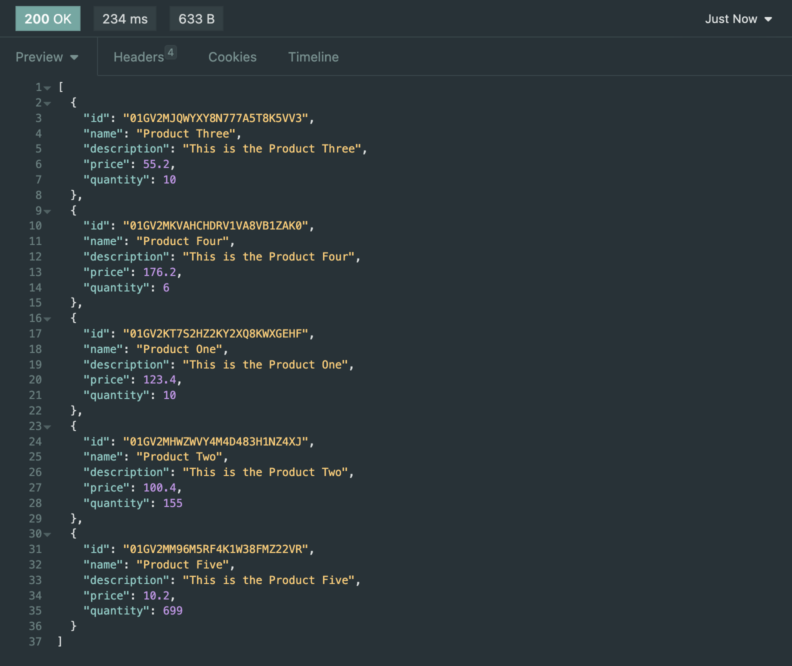
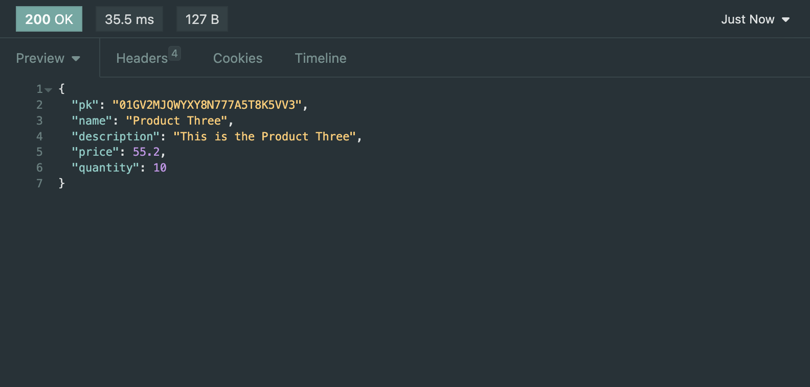

# MyFast

`This Project still On going Development, kindly wait for the next update`

## Description
This is a Simple Backend `CRUD-Microservices` Project using `FastAPI`
and it would be consumed by `React` on the Frontend.

## Installation
### Clone the repository
```bash
git clone https://github.com/ivandi1980/my-fast.git
```

## Usage
```bash
# Run the server
uvicorn main:app --reload
```

for local access :
```BaseUrl : http://localhost:8000/api/v1```

| Endpoint        | Description                  | Method |
|:----------------|:-----------------------------|:-------|
| `/products`     | Get All Products             | GET    |
| `/product`      | Insert Product into Database | POST   |
| `/product/{id}` | Get Single Product           | GET    |
| `/product/{id}` | Update Product               | PUT    |
| `/product/{id}` | Delete Product               | DELETE |

## Screenshots
- Add Product
  
- Get All Products

- Get Single Product


## Contributing
Pull requests are welcome. For major changes, please open an issue first to discuss what you would like to change.

Please make sure to update tests as appropriate.


## License
[MIT](https://choosealicense.com/licenses/mit/)

## Author
[ivandjoh](https://linkedin.com/in/ivandjoh)